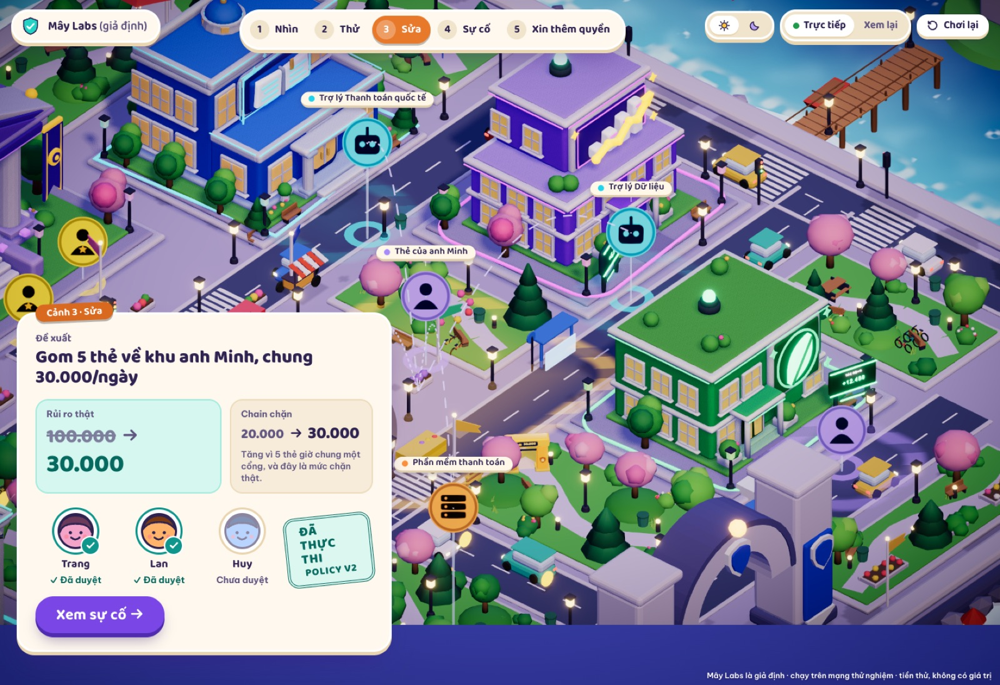
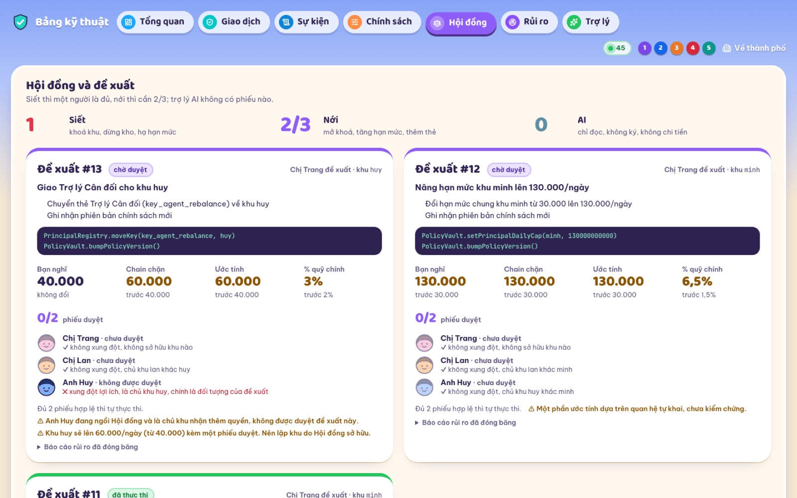
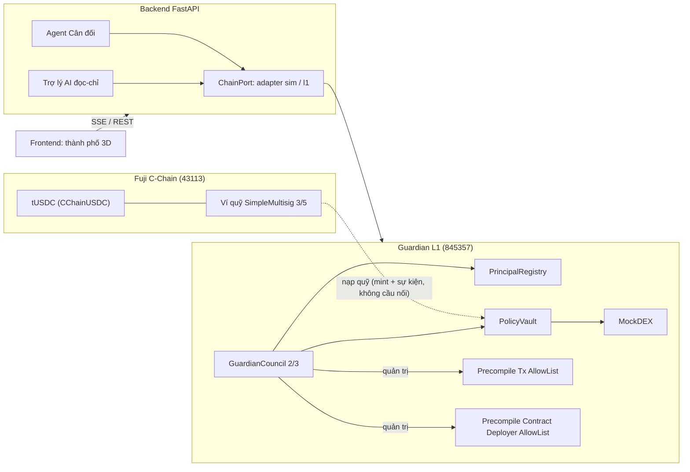

# Cordon

**Demo trực tuyến:** https://nostidus4.github.io/Cordon/ (chạy hoàn toàn trong trình duyệt với **chain giả lập**, không cần server; chain thật xem phần [Avalanche](#avalanche)).

## English summary

Cordon is a spending-control layer for companies whose money is moved by people, cards and AI agents. Every spending
key belongs to a "district" with its own daily cap and whitelist, enforced by contracts on a Guardian L1 (Avalanche
Subnet-EVM, Fuji, chain id 845357). Rules: (1) **tightening is immediate**, by a single Council member; (2) **loosening
needs a 2-of-3 Council vote** plus a 15 s timelock and a conflict-of-interest check; (3) **the AI never signs or moves
money** (the assistant is read-only, the rebalance agent is bound by the same contract rules). An emergency lock removes
a district's keys from the **Tx AllowList precompile**, so the node itself rejects their transactions. The contracts,
the lock and the Council are real and deployed on the Fuji L1; the DEX, the attacker and the C-Chain to L1 top-up are
mocks (see the table "Thật hay giả lập"). The public GitHub Pages demo runs a simulated chain in the browser.
Verify on-chain claims with the commands in [Avalanche](#avalanche); known limits are in [SECURITY.md](SECURITY.md).

## Vấn đề và giải pháp

Công ty đưa chìa khoá chi tiền cho nhiều người, thẻ và AI agent, nhưng thường không ai biết một chìa bị lộ thì mất tối
đa bao nhiêu. Cordon cho thấy ai giữ chìa nào, mô phỏng thiệt hại nếu một chìa bị chiếm, rồi dựng "hàng rào" ở tầng
giao thức: hạn mức ngày của từng thẻ, hạn mức chung của cả **khu**, danh sách trắng đích đến, và công tắc khoá khẩn cấp
trên một Avalanche L1. Một thẻ bị lộ chỉ thiệt trong khu của nó. Trợ lý AI chỉ đọc dữ liệu, không bao giờ ký hay chuyển tiền.

## Ba luật cốt lõi

1. **Siết thì làm ngay:** hạ hạn mức, thu hồi quyền, tạm dừng hay khoá khẩn cấp do **một** thành viên Hội đồng làm, không cần bỏ phiếu.
2. **Nới luôn cần Hội đồng 2/3:** nâng hạn mức hay thêm quyền phải qua đề xuất, 2 trên 3 thành viên duyệt, chờ timelock 15 s, và người có lợi ích liên quan không được duyệt. Không có đường tự động nào được nới.
3. **AI không có quyền chi:** trợ lý chỉ đọc; agent Cân đối chỉ hoán đổi trong whitelist và vẫn bị chain chặn bằng cùng bộ luật.

## Năm cảnh

1. **Nhìn:** thành phố 3D thể hiện ai giữ chìa nào, tòa nào đang an toàn hay có rủi ro.
2. **Thử:** giả lập một thẻ bị chiếm và so sánh "bạn nghĩ", "chain thật sự chặn" và ước tính thiệt hại.
3. **Sửa:** đề xuất chính sách mới, hội đồng duyệt, hạn mức dùng chung được áp dụng.
4. **Sự cố:** kẻ tấn công thử rút tiền, giao dịch bị chặn, khoá khẩn cấp được bật rồi phục hồi.
5. **Xin thêm quyền:** yêu cầu nâng quyền được so sánh trước/sau trước khi hội đồng quyết định.

| Thử | Sự cố | Sửa |
|---|---|---|
|  |  |  |

Bảng điều khiển kỹ thuật (`/he-thong/*`) dành cho kỹ sư:

| Tổng quan | Hội đồng |
|---|---|
|  |  |

## Kiến trúc

```mermaid
flowchart LR
  subgraph C["Fuji C-Chain (43113)"]
    TK["tUSDC (CChainUSDC)"]
    MS["Ví quỹ SimpleMultisig 3/5"]
  end
  subgraph L1["Guardian L1 (845357)"]
    REG["PrincipalRegistry"]
    VLT["PolicyVault"]
    CNL["GuardianCouncil 2/3"]
    DEX["MockDEX"]
    TXA["Precompile Tx AllowList"]
    DPA["Precompile Contract Deployer AllowList"]
  end
  subgraph BE["Backend FastAPI"]
    PORT["ChainPort: adapter sim / l1"]
    AG["Agent Cân đối"]
    AS["Trợ lý AI đọc-chỉ"]
  end
  FE["Frontend: thành phố 3D"]
  TK --- MS
  MS -. "nạp quỹ (mint + sự kiện, không cầu nối)" .-> VLT
  CNL --> REG
  CNL --> VLT
  CNL -- "quản trị" --> TXA
  CNL -- "quản trị" --> DPA
  VLT --> DEX
  PORT --> L1
  AG --> PORT
  AS --> PORT
  FE -- "SSE / REST" --> BE
```

## Thật hay giả lập

| Thành phần | Trạng thái |
|---|---|
| Contract `PrincipalRegistry`, `PolicyVault`, `GuardianCouncil` trên Guardian L1 (Fuji) | **Thật**, đã deploy |
| Khoá khẩn cấp ở tầng node (gỡ khoá khỏi Tx AllowList, node từ chối giao dịch, không có tx hash) | **Thật** |
| Hội đồng 2/3, timelock 15 s, chặn xung đột lợi ích | **Thật** (on-chain) |
| Bàn giao quyền deployer (sau đó Hội đồng là admin của cả hai precompile) | **Thật** |
| Token và ví quỹ multisig 3/5 trên Fuji C-Chain | **Thật** (testnet) |
| Giá `MockDEX` / `EvilDEX` | Giả lập (tỷ giá cố định, chỉ để demo) |
| Kẻ tấn công | Kịch bản dựng sẵn (attacker CLI) |
| Nạp quỹ từ C-Chain sang L1 | Giả lập: mint token + ghi sự kiện, **không có cầu nối**; contract không kiểm tra giao dịch C-Chain |
| Demo GitHub Pages | Chạy **chain giả lập trong trình duyệt**, không nối Fuji |
| Contract quỹ lương (payroll) | Đã viết và test bằng forge, mô phỏng trong backend, **chưa deploy** ([PAYROLL.md](docs/spec/PAYROLL.md)) |
| Khoá Hội đồng trong demo | Backend giữ **cả 3 khoá test** của Hội đồng (bản thật: mỗi người ký bằng ví riêng) |

## Avalanche

- **Guardian L1:** Subnet-EVM trên Fuji, chain id **845357**, validator chạy cục bộ. Không có explorer công khai nên bằng chứng là biên nhận RPC. Genesis và bàn giao: [contracts/genesis/](contracts/genesis/), [infra/l1/](infra/l1/).
- **Vì sao Avalanche:** Tx AllowList và Contract Deployer AllowList là precompile của Subnet-EVM. Khoá khẩn cấp chặn ở **tầng node**: khoá bị gỡ thì giao dịch bị từ chối trước khi vào chain, không dựa vào việc contract tự từ chối.
- **Bản nộp đóng băng** (`deployBlock` 834): các địa chỉ dưới đây khớp [fuji-l1.json](Backend/deployments/fuji-l1.json) và [fuji-c.json](Backend/deployments/fuji-c.json). Mỗi lần `demo-reset` deploy lại, nên địa chỉ cũ trong lịch sử chain thuộc bản trước.

Guardian L1 (845357):

| Contract | Địa chỉ |
|---|---|
| PrincipalRegistry | `0xabC0aD1F6Cb42263fBDD348FD2b78f7ac8bEb924` |
| PolicyVault | `0xFFF7FcaEbB53Db34a64065aEEA1573f1323D3865` |
| GuardianCouncil | `0xE5a4F0da66836cB79FAc4618101C8CFf5E49ab02` |
| MockDEX | `0x2800b6d67a3d0cF4022ae70D93D571bAF3CC1b9A` |
| EvilDEX | `0x54420aA8217299eD129092268Fadf4d440Cc0fb7` |
| tUSDC | `0x58190c4686F0245bE6D6E498112F6F58E193215F` |
| tTKB | `0x7B3a366776dfA2ec705d8Fd9a312D0F9C0d7D203` |
| tSCAM | `0xB1404097C5C5D6E1a4abE6c8D446692fCE448837` |
| Tx AllowList (precompile) | `0x0200000000000000000000000000000000000002` |
| Contract Deployer AllowList (precompile) | `0x0200000000000000000000000000000000000000` |

Fuji C-Chain (43113), xem trên Snowtrace:

| Thành phần | Địa chỉ |
|---|---|
| Token (CChainUSDC) | [`0x65954209aa3cf99eb77A90e55cD1dD3e94b1Fc02`](https://testnet.snowtrace.io/address/0x65954209aa3cf99eb77A90e55cD1dD3e94b1Fc02) |
| Ví quỹ (SimpleMultisig 3/5) | [`0xD000D0cE700B455A360C27c87A230F5A2c197D4D`](https://testnet.snowtrace.io/address/0xD000D0cE700B455A360C27c87A230F5A2c197D4D) |
| `escrow` | [`0xF9f119A52B11FB6b92a7fB87e3B775C17d91ef3A`](https://testnet.snowtrace.io/address/0xF9f119A52B11FB6b92a7fB87e3B775C17d91ef3A) |

`escrow` **không có mã contract, có chủ đích**: đó là địa chỉ không khoá (suy ra từ hash, không ai giữ khoá), là đích mà ví quỹ chuyển token tới khi nạp quỹ (backend đọc sự kiện `Transfer` từ ví quỹ tới địa chỉ này). Snowtrace hiện nó như tài khoản thường.

**Tự kiểm chứng** (chỉ đọc, không tốn gas). RPC của L1 là của validator cục bộ (cần chạy validator, hoặc dùng proxy chỉ-đọc ở mục "Đang hoàn thiện"). Biên nhận deploy và kết quả đã chạy: [docs/qa/D1-D10.md](docs/qa/D1-D10.md).

    export RPC=http://127.0.0.1:9650/ext/bc/4hnXBqtkcq2uj8e3rcfGKh3NDBn3CgrWPe4tk71WQFfP4rTTb/rpc
    # chain id = 845357 (0xce62d)
    curl -s -X POST -H 'content-type: application/json' $RPC \
      --data '{"jsonrpc":"2.0","id":1,"method":"eth_chainId","params":[]}'
    # có mã contract tại PolicyVault (kết quả khác "0x")
    curl -s -X POST -H 'content-type: application/json' $RPC \
      --data '{"jsonrpc":"2.0","id":1,"method":"eth_getCode","params":["0xFFF7FcaEbB53Db34a64065aEEA1573f1323D3865","latest"]}' | head -c 120
    # vai trò của Council trên hai precompile: kỳ vọng 2 (admin)
    cast call 0x0200000000000000000000000000000000000002 'readAllowList(address)(uint256)' 0xE5a4F0da66836cB79FAc4618101C8CFf5E49ab02 --rpc-url $RPC
    cast call 0x0200000000000000000000000000000000000000 'readAllowList(address)(uint256)' 0xE5a4F0da66836cB79FAc4618101C8CFf5E49ab02 --rpc-url $RPC
    # ví quỹ trên Fuji C-Chain có mã
    cast code 0xD000D0cE700B455A360C27c87A230F5A2c197D4D --rpc-url https://api.avax-test.network/ext/bc/C/rpc | head -c 80

Đã đọc lại ngày 2026-11-16 (chỉ đọc): cả 8 contract L1 có mã, Council đọc 2 trên cả hai precompile, ba thành viên đọc 1 (Tx) và 0 (Deployer), token và ví quỹ C-Chain có mã.

## Công nghệ

| Phần | Công nghệ |
|---|---|
| Frontend | React, Vite, TypeScript, Tailwind, React Flow, three.js / react-three-fiber |
| Backend | FastAPI, uv; `ChainPort` có hai adapter: `CHAIN_MODE=sim` (bộ nhớ) và `CHAIN_MODE=l1` (Guardian L1 thật) |
| Contract | Solidity, Foundry (`contracts/`), genesis Guardian L1 (`contracts/genesis/`, `infra/l1/`) |
| Thành phố 3D | Script Blender `bpy` (`Blender/scripts/`), xuất `.glb` vào `Frontend/public/models/city/` |
| Hạ tầng | Docker Compose, GitHub Actions (CI + GitHub Pages), pre-commit |

| Thư mục | Nội dung |
|---|---|
| `Backend/` | API FastAPI, đồ thị, mô phỏng, trợ lý đọc-chỉ, agent Cân đối, attacker CLI, adapter chain `sim` và `l1` |
| `Frontend/` | Giao diện thành phố 3D, bảng điều khiển kỹ thuật, backend giả lập chạy trong trình duyệt |
| `contracts/` | Contract Foundry, genesis Guardian L1 |
| `infra/` | Script L1 (`infra/l1/`), C-Chain, demo-reset, e2e |
| `Blender/` | Script dựng 8 công trình, file `.blend` nguồn |
| `docs/` | Tài liệu phát triển, spec, QA, ảnh minh hoạ |

## Kiểm thử

| Bộ | Kết quả |
|---|---|
| Contract (`cd contracts && FOUNDRY_PROFILE=ci forge test`) | **312 passed**, 0 failed (chạy lại 2026-11-16); line coverage 98.49%, branch 89.68% (đo trước đó) |
| Backend (`pytest`) | 951 passed |
| Frontend (`vitest`) | 210 passed |
| CI (GitHub Actions) | xanh trên `main` |
| e2e cảnh 1-5 trên L1 thật | 65/65 kiểm tra, xem [docs/qa/D1-D10.md](docs/qa/D1-D10.md) |

    make test            # pytest (Backend) + vitest (Frontend)
    make lint            # ruff, eslint, tsc
    make contracts-test  # forge test

## Chạy thử

Cần `uv`, Node 22 và (tuỳ chọn) Docker.

    make setup      # cài phụ thuộc Backend + Frontend, hook pre-commit
    make dev-web    # giao diện tại http://localhost:5173 (mặc định dùng backend giả lập trong trình duyệt)
    make dev-api    # API FastAPI tại http://localhost:8000 (dùng với VITE_API_MODE=live)
    cp .env.example .env           # đặt POSTGRES_PASSWORD (docker compose cần biến này)
    docker compose up --build -d   # api :8000, web :8080
    make db-up db-migrate          # (tuỳ chọn) Postgres 16 + alembic upgrade head

Chạy stack trên Guardian L1 thật (`make l1-proxy`, `make stack-l1`, demo-reset): xem mục "The same stack on the Guardian L1" trong [docs/DEVELOPMENT.md](docs/DEVELOPMENT.md). Cần validator và khoá test của chủ dự án, không có trong repo.

## Đang hoàn thiện

Do đồng đội làm song song, có thể chưa có trên `main`; nếu chưa thấy trong repo thì coi như chưa xong:

- Trang `/bang-chung`: bằng chứng chain (địa chỉ, biên nhận) ngay trên giao diện.
- `make l1-readonly-rpc`: proxy RPC công khai chỉ-đọc (`infra/l1/readonly_rpc_proxy.py`) để người chấm gọi `cast`/`curl` mà không cần validator.
- Phiếu bầu của Hội đồng ký bằng ví trình duyệt (hiện backend giữ khoá test của 3 thành viên).

## Bảo mật và giới hạn

- Mô hình đe doạ và các giới hạn đã biết (Hội đồng cố định, một người veto được mãi, `SimpleMultisig` tự viết chưa audit, ...): [SECURITY.md](SECURITY.md).
- Dữ liệu mẫu là hư cấu ("Mây Labs").

**Lưu ý pháp lý:** dự án chỉ chạy trên **testnet**; mọi token là token thử nghiệm, **không có giá trị**. Tiền mã hoá không phải phương tiện thanh toán hợp pháp tại Việt Nam. Nội dung không phải lời khuyên đầu tư hay tài chính.

## Giấy phép

Bản quyền thuộc Nostidus4, bảo lưu mọi quyền. Mã nguồn chỉ để xem trên GitHub; xem [LICENSE](LICENSE).
